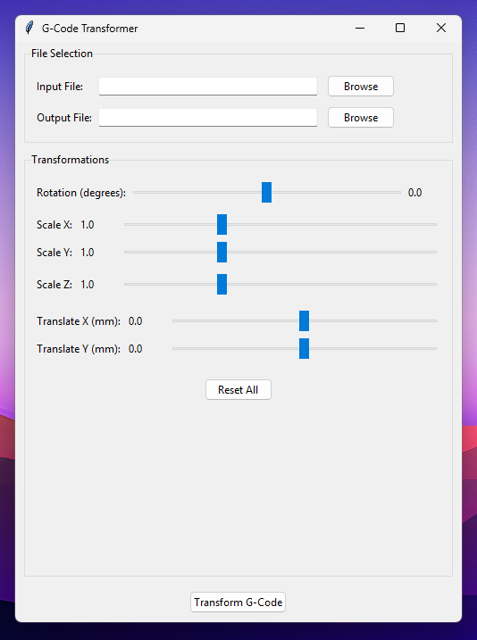

# GCode-PostProcessor
The following script can modify 3D print models after they have been sliced.



## Supported Functions
- Transform on X and Y axis
- Scale on X, Y and Z axis
- Rotate on XY plane

## Supported Slicers
Supports the majority of common slicers (Cura, Prusaslicer, Superslicer, etc.). Be sure to inspect the output code to make sure it is still on your bed/machine limits.

## Instructions
Open a command prompt or terminal in the folder the python file is contained in. Run the following command (or python3 depending on your installation):
```
python gcode_postprocessor.py
```

The outputted file will be in the same folder.